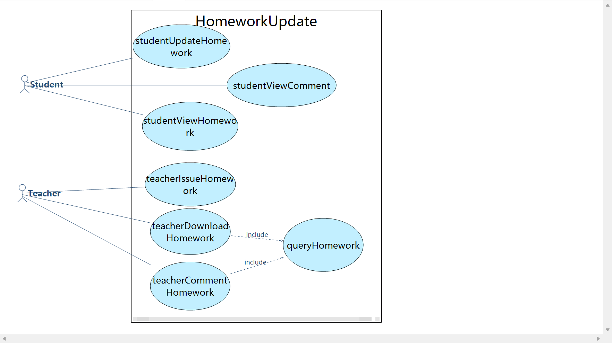
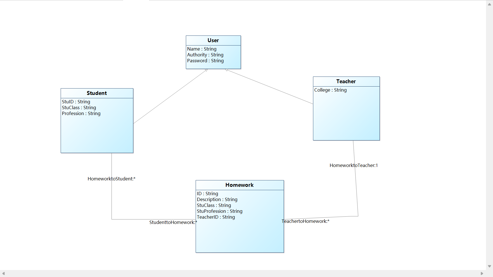
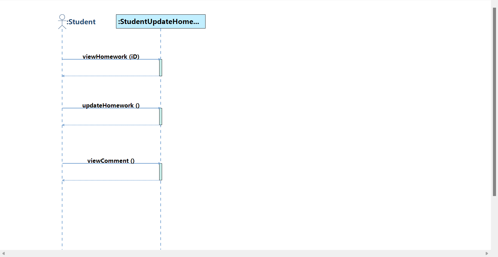
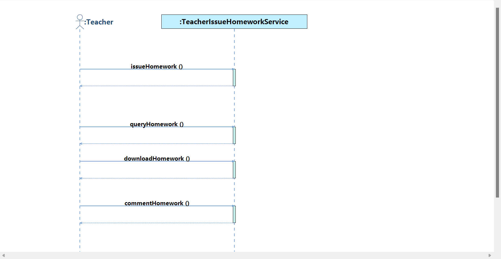
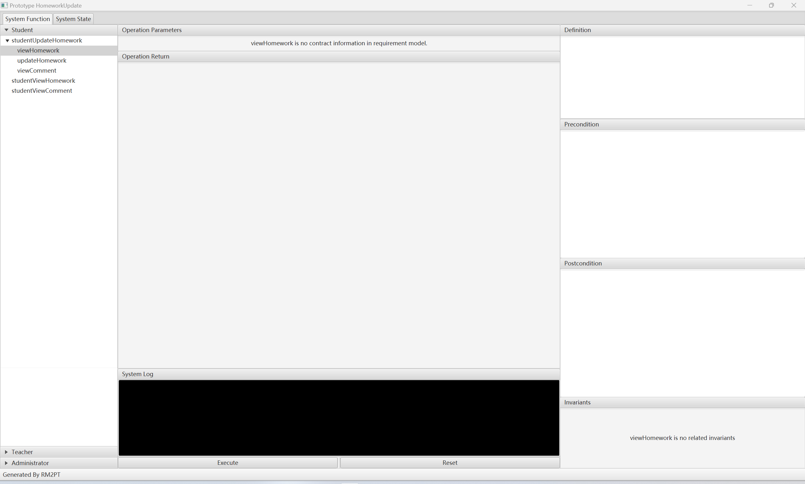
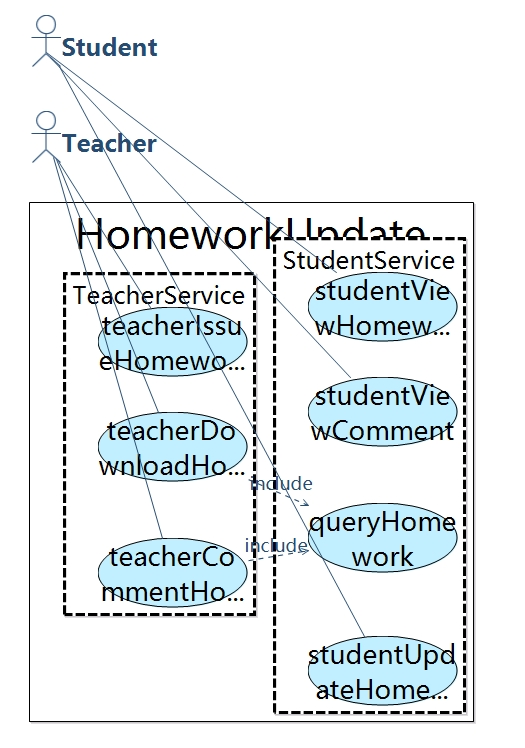
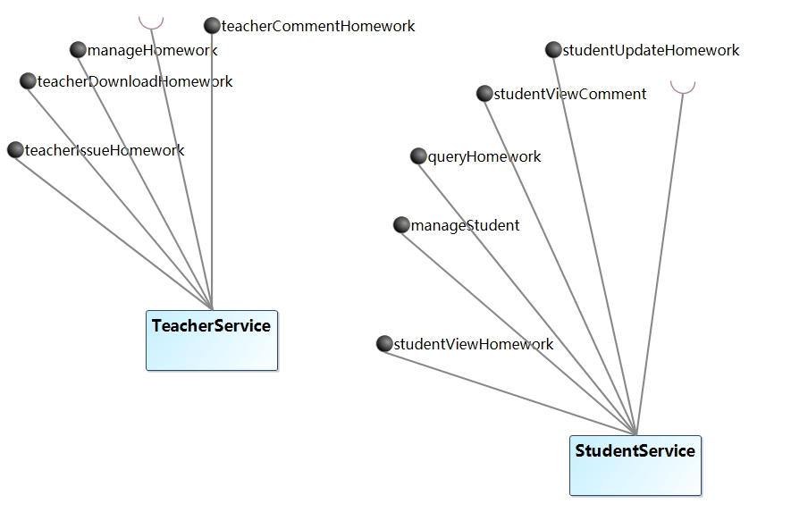
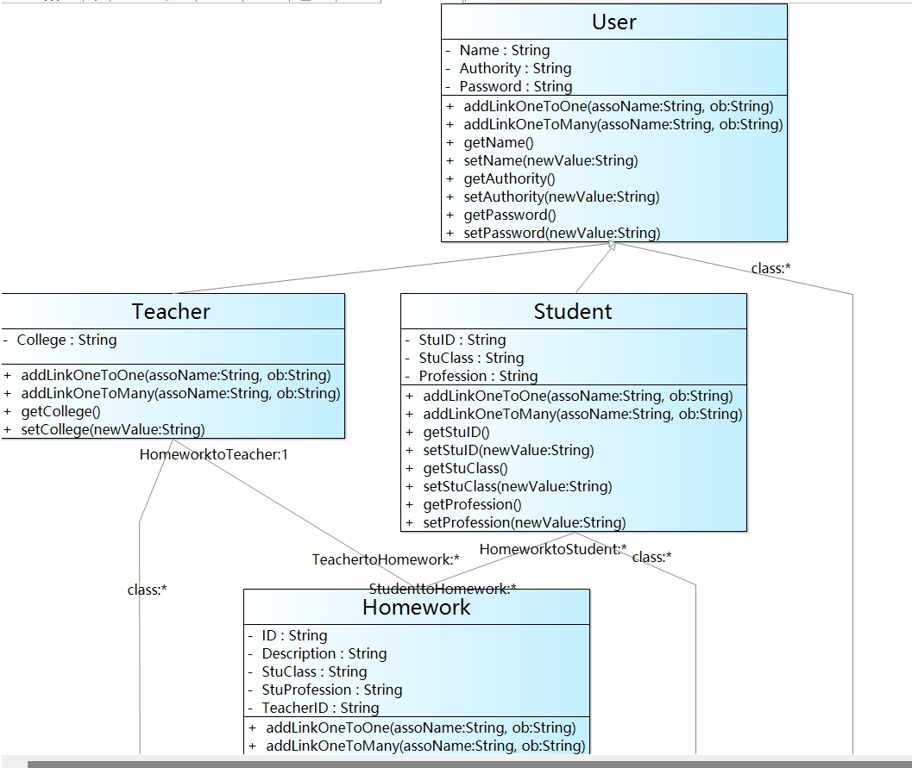
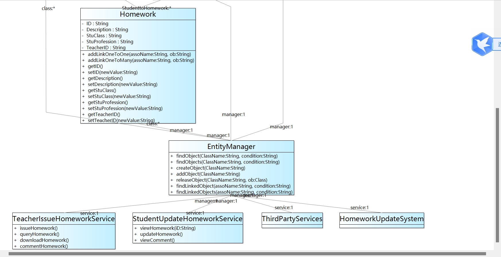
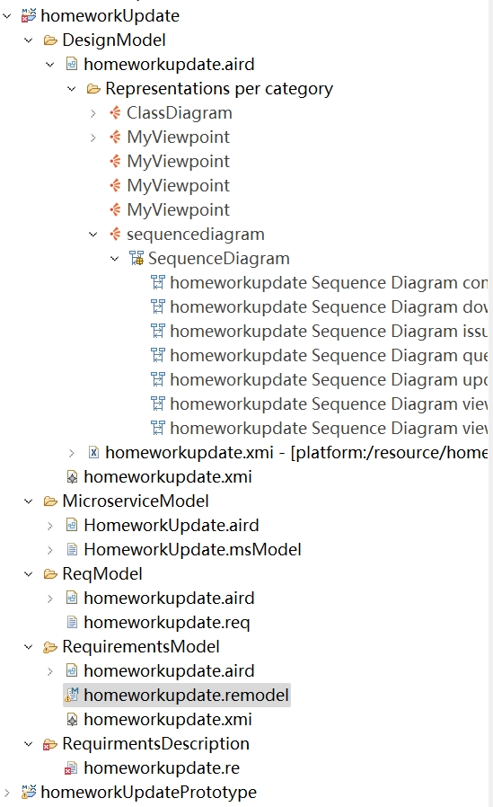

# Software-requrement-analysis-first-experiment

### 自然语言需求数量：8
### Actor数量：2
### 用例数量：7
### 系统顺序图数量：2
### 系统操作总数：7
### 系统合约数量：
### 类数量：4
---
**用例图：**

**类图：**

**学生顺序图：**

**教师顺序图:**

**结果图：**

---

**第三次实验结果图：**
---

